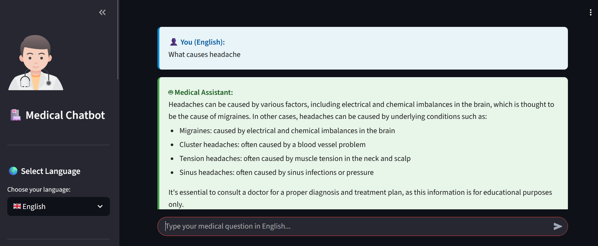
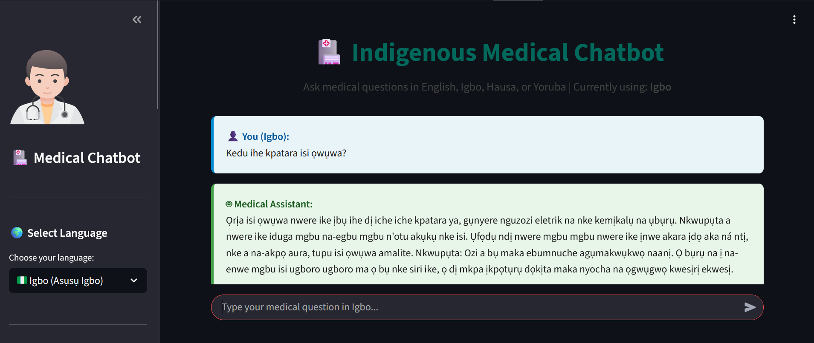
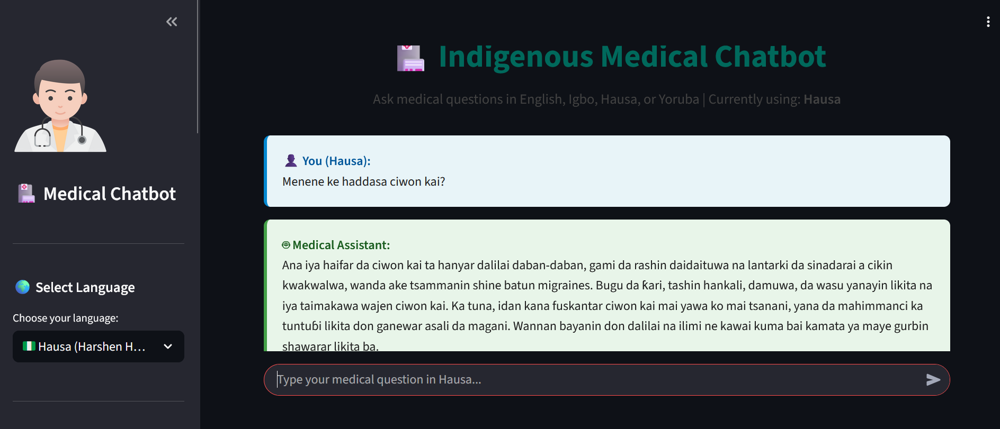
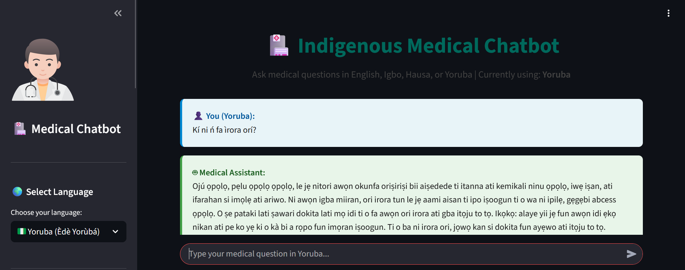

# 🏥 Indigenous Medical Chatbot

[](https://streamlit.io/)
[](https://huggingface.co/spaces/Wondikom/Indigenous-ai-chatbot)
[](https://www.python.org/)

> **Making healthcare information accessible in Nigerian languages**

An AI-powered medical chatbot that provides health information in **English, Igbo, Hausa, and Yoruba**. Built to bridge the language gap in healthcare access across Nigeria.


## ✨ Features

### 🗣️ **Multilingual Support**
- Seamlessly switch between English, Igbo, Hausa, and Yoruba
- Real-time translation using state-of-the-art NLLB model
- Natural, contextual responses in each language

### 🤖 **Intelligent Medical Assistant**
- Powered by advanced AI (Groq LLM)
- Access to 2,735+ medical articles from Gale Encyclopedia of Medicine
- Semantic search using Pinecone vector database
- Context-aware answers with source citations

### 💡 **User-Friendly Interface**
- Clean, intuitive chat interface
- Sample questions in all languages
- Source transparency with relevance scores
- Mobile-responsive design

### 🔒 **Safe & Ethical**
- Clear medical disclaimers
- Educational information only
- Encourages professional medical consultation

---

## 🎬 Demo

### English Interface


### Igbo Interface (Asụsụ Igbo)


### Hausa Interface (Harshen Hausa)

     
### Yoruba Interface (Èdè Yorùbá)


---

## 🚀 Quick Start

### Try It Online
Visit the live demo: **[Indigenous Medical Chatbot](https://huggingface.co/spaces/Wondikom/Indigenous-ai-chatbot)**

### Run Locally  

1. **Clone the repository**
```bash
git clone https://huggingface.co/spaces/Wondikom/Indigenous-ai-chatbot
cd Indigenous-ai-chatbot
```

2. **Install dependencies**
```bash
pip install -r requirements.txt
```

3. **Set up environment variables**
Create a `.env` file in the root directory:
```env
PINECONE_API_KEY=your_pinecone_api_key_here
GROQ_API_KEY=your_groq_api_key_here
```

4. **Run the application**
```bash
streamlit run app.py
```

5. **Open your browser**
Navigate to `http://localhost:8501`

---

## 🛠️ Technology Stack

### AI & ML
- **[Groq](https://groq.com/)** - Lightning-fast LLM inference (Llama 3.1)
- **[Pinecone](https://www.pinecone.io/)** - Vector database for semantic search
- **[Sentence Transformers](https://www.sbert.net/)** - Text embeddings (all-MiniLM-L6-v2)
- **[NLLB-200](https://github.com/facebookresearch/fairseq/tree/nllb)** - Meta's multilingual translation model

### Framework 
- **[Streamlit](https://streamlit.io/)** - Interactive web application framework
- **[Hugging Face Transformers](https://huggingface.co/docs/transformers/)** - NLP model hub

### Deployment
- **Docker** - Containerized deployment
- **Hugging Face Spaces** - Hosting platform

---

## 📚 Knowledge Base

The chatbot is powered by the **Gale Encyclopedia of Medicine**, containing:
- 📖 **2,735 medical articles**
- 🏥 Topics covering diseases, treatments, symptoms, and prevention
- 🔬 Evidence-based medical information
- 🌐 Accessible in multiple Nigerian languages

---

## 🎯 Use Cases

### For Patients
- 🔍 Understand symptoms in your native language
- 💊 Learn about common diseases and treatments
- 🏥 Get preliminary health information before doctor visits
- 📱 Access medical knowledge anytime, anywhere

### For Healthcare Workers
- 🗣️ Communicate better with non-English speaking patients
- 📖 Educational tool for community health programs
- 🌍 Bridge language barriers in rural healthcare

### For Researchers
- 📊 Study healthcare information access across languages
- 🔬 Analyze health literacy in indigenous languages
- 💡 Develop improved multilingual health tools

---

## 🏗️ Architecture

```
User Query (Any Language)
        ↓
    Translation to English (if needed)
        ↓
    Text Embedding (Sentence Transformers)
        ↓
    Semantic Search (Pinecone Vector DB)
        ↓
    Context Retrieval (Top 3 relevant articles)
        ↓
    Answer Generation (Groq LLM)
        ↓
    Translation to User's Language (if needed)
        ↓
    Display with Sources & Citations
```

---

## 📦 Project Structure

```
indigenous-ai-chatbot/
├── app.py                  
├── requirements.txt        
├── Dockerfile             
├── README.md           
├── .env               
├── .gitignore            
└── images/              
    ├── english.png
    ├── igbo.png
    ├── hausa.png
    ├── yoruba.png
   
    
   
   
```

---

## 🔑 API Keys Setup

You'll need API keys from:

1. **Pinecone** (Vector Database)
   - Sign up at [pinecone.io](https://www.pinecone.io/)
   - Create a free tier account
   - Generate an API key
   - Create an index named `medicalbot`

2. **Groq** (LLM Inference)
   - Sign up at [console.groq.com](https://console.groq.com/)
   - Generate an API key
   - Free tier available

---

## ⚙️ Configuration

### Environment Variables

| Variable | Description | Required |
|----------|-------------|----------|
| `PINECONE_API_KEY` | Your Pinecone API key | ✅ Yes |
| `GROQ_API_KEY` | Your Groq API key | ✅ Yes |

### Model Configuration

Edit these in `app.py` if needed:

```python
# Embedding model
embedding_model = SentenceTransformer('all-MiniLM-L6-v2')

# Translation model
translator = AutoModelForSeq2SeqLM.from_pretrained("facebook/nllb-200-distilled-600M")

# LLM model
groq_client.chat.completions.create(model="llama-3.1-8b-instant", ...)
```

---

## 🌟 Example Queries

### English
- "What causes malaria?"
- "How to treat diabetes?"
- "What are symptoms of high blood pressure?"

### Igbo (Asụsụ Igbo)
- "Gịnị na-akpata ịba?" *(What causes malaria?)*
- "Kedu ka esi agwọ ọrịa shuga?" *(How to treat diabetes?)*

### Hausa (Harshen Hausa)
- "Menene ke haifar da zazzabin cizon sauro?" *(What causes malaria?)*
- "Ta yaya ake maganin ciwon sikari?" *(How to treat diabetes?)*

### Yoruba (Èdè Yorùbá)
- "Kini o nfa iba?" *(What causes malaria?)*
- "Bawo ni a ṣe le ṣe itọju aisan suga?" *(How to treat diabetes?)*

---

## ⚠️ Important Disclaimers

### Medical Disclaimer
> **This chatbot provides educational information only and is NOT a substitute for professional medical advice, diagnosis, or treatment.**
> 
> - Always consult qualified healthcare providers for medical decisions
> - In case of emergency, contact your local emergency services immediately
> - Do not disregard professional medical advice based on information from this chatbot

### Translation Accuracy
> While we use state-of-the-art translation models, medical terminology translation may not always be perfectly accurate. When in doubt, consult with healthcare professionals who speak your language.

---

## 🤝 Contributing

We welcome contributions! Here's how you can help:

1. **Report Issues** - Found a bug? [Open an issue](https://huggingface.co/spaces/Wondikom/Indigenous-ai-chatbot/discussions)
2. **Improve Translations** - Native speaker? Help improve language accuracy
3. **Add Features** - Submit pull requests for new features
4. **Expand Knowledge Base** - Suggest additional medical resources
5. **Test & Feedback** - Use the app and share your experience

---

## 📈 Roadmap

- [ ] Add more Nigerian languages (Fulani, Edo, Ibibio, etc.)
- [ ] Voice input/output for accessibility
- [ ] Offline mode for rural areas
- [ ] Integration with local health records (with privacy)
- [ ] Community health worker training module
- [ ] SMS/WhatsApp integration
- [ ] Pediatric health focus
- [ ] Mental health support

---

## 📄 License

This project is open source and available under the [MIT License](LICENSE).

---

## 👨‍💻 Author

**Wondikom**
- Hugging Face: [@Wondikom](https://huggingface.co/Wondikom)
- Project: [Indigenous AI Chatbot](https://huggingface.co/spaces/Wondikom/Indigenous-ai-chatbot)

---

## 🙏 Acknowledgments

- **Gale Encyclopedia of Medicine** - For the comprehensive medical knowledge base
- **Meta AI** - For the NLLB translation model
- **Anthropic, Groq, Pinecone** - For providing excellent AI infrastructure
- **Hugging Face** - For hosting and model distribution
- **Nigerian Language Communities** - For inspiration to bridge healthcare gaps

---

## 📞 Support

- 🐛 **Bug Reports**: [GitHub Issues](https://huggingface.co/spaces/Wondikom/Indigenous-ai-chatbot/discussions)
- 💬 **Questions**: [Hugging Face Discussions](https://huggingface.co/spaces/Wondikom/Indigenous-ai-chatbot/discussions)
- 📧 **Email**: [Contact through Hugging Face profile]

---

## 📊 Stats


---


### ⭐ Star this project if you find it helpful!

**Made with ❤️ for accessible healthcare in Nigeria**

[🚀 Try the Live Demo](https://huggingface.co/spaces/Wondikom/Indigenous-ai-chatbot) | [📖 Documentation](https://huggingface.co/spaces/Wondikom/Indigenous-ai-chatbot) | [🤝 Contribute](https://huggingface.co/spaces/Wondikom/Indigenous-ai-chatbot/discussions)
